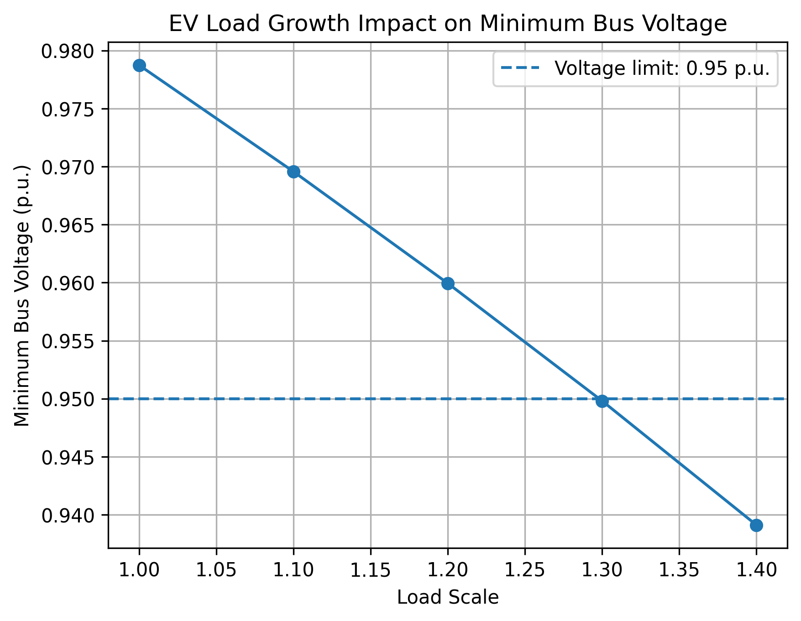
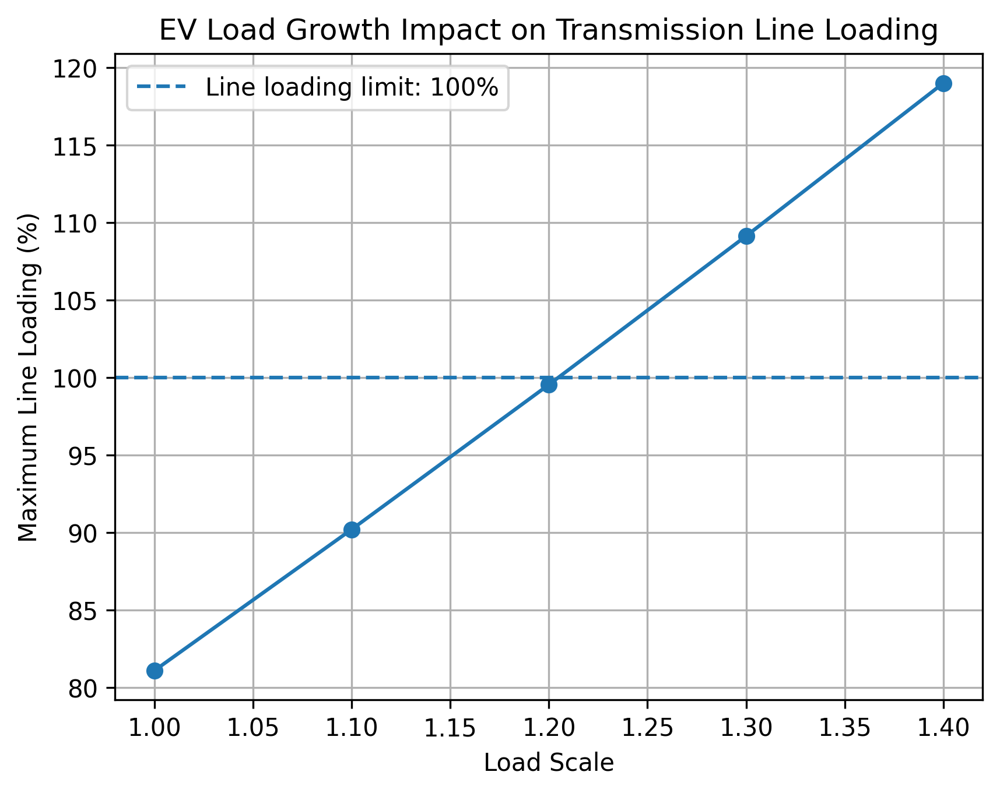

# North Island Grid Backbone Power Flow Study using pandapower

## Project Overview

This project develops a simplified power flow model inspired by New Zealand's North Island Grid Backbone using Python and pandapower.

The study investigates:

- Base case power flow performance
- Bus voltage profile
- Transmission line loading
- Transformer loading
- Shunt capacitor impact
- EV-driven load growth impact

## Tools Used

- Python
- pandapower
- pandas
- matplotlib
- PyCharm
- GitHub Codespaces

## Run in GitHub Codespaces

This project can be run directly in GitHub Codespaces without installing Python, pandapower, or PyCharm locally.

1. Click the green **Code** button on this repository.
2. Select the **Codespaces** tab.
3. Click **Create codespace on main**.
4. Wait for the environment to build.
5. Run the full study in the Codespaces terminal:

```bash
python src/run_all.py
```

The output CSV files and figures will be generated in the `results/` folder.

## Run Locally

To run this project locally, first install the required packages:

```bash
pip install -r requirements.txt
```

Then run the full study:

```bash
python src/run_all.py
```

Alternatively, each script can be run individually:

```bash
python src/run_power_flow.py
python src/scenario_capacitor_bank.py
python src/scenario_ev_growth.py
python src/plot_ev_growth_results.py
```

## Project Structure

```text
nigb-pandapower-study/
├── .devcontainer/
│   └── devcontainer.json
├── data/
│   └── README.md
├── docs/
│   ├── assumptions.md
│   ├── methodology.md
│   └── references.md
├── results/
│   ├── bus_voltage_results.csv
│   ├── line_loading_results.csv
│   ├── transformer_loading_results.csv
│   ├── capacitor_voltage_comparison.csv
│   ├── capacitor_line_loading_comparison.csv
│   ├── ev_load_growth_summary.csv
│   ├── ev_growth_min_voltage.png
│   └── ev_growth_line_loading.png
├── src/
│   ├── build_network.py
│   ├── run_power_flow.py
│   ├── scenario_capacitor_bank.py
│   ├── scenario_ev_growth.py
│   ├── plot_ev_growth_results.py
│   └── run_all.py
├── .gitignore
├── README.md
└── requirements.txt
```

## Study Scenarios

### 1. Base Case Power Flow

A simplified 5-bus transmission network was built and analysed using pandapower.

The base case successfully converged, with all bus voltages within the normal operating range and no overloaded transmission elements.

The base case analysis outputs:

- Bus voltage magnitude
- Bus voltage angle
- Transmission line active and reactive power flow
- Transmission line loading
- Transformer loading

### 2. Shunt Capacitor Sensitivity

A capacitor bank scenario was simulated by comparing the network with and without capacitor support at Otahuhu.

The capacitor improved the Otahuhu 220 kV bus voltage and reduced the loading of the main transmission lines.

This demonstrates the role of reactive power compensation in:

- Voltage support
- Reactive power management
- Transmission loading reduction
- Improving system operating margins

### 3. EV Load Growth Scenario

An EV load growth scenario was simulated by scaling system load from 1.0x to 1.4x.

The results show that the simplified network remains within voltage and line loading limits up to around 1.2x load growth.

At 1.3x load growth:

- The Otahuhu 220 kV bus voltage drops below 0.95 p.u.
- The Bunnythorpe-Hamilton line exceeds 100% loading.

This indicates that future demand growth may require:

- Additional voltage support
- Reactive power compensation
- Transmission reinforcement
- Load growth planning studies

## Results

### EV Load Growth Impact on Minimum Bus Voltage



The minimum bus voltage decreases as EV-driven load increases. A voltage violation occurs at approximately 1.3x load growth.

### EV Load Growth Impact on Transmission Line Loading



The maximum transmission line loading increases as load grows and exceeds the 100% loading limit at approximately 1.3x load growth.

## Key Findings

- The base case power flow converges successfully.
- All bus voltages remain within normal limits under the base case.
- Shunt capacitor support improves the voltage profile near Otahuhu.
- Shunt capacitor support also reduces the loading of the main transmission lines.
- EV-driven load growth causes both voltage decline and higher transmission line loading.
- At around 1.3x load growth, the simplified network begins to show voltage violation and line overload issues.
- The main bottleneck in the EV load growth scenario is the Bunnythorpe-Hamilton transmission line.
- The most voltage-sensitive bus in the model is Otahuhu 220 kV.

## Engineering Relevance

This project demonstrates practical power system modelling and analysis skills, including:

- Transmission network modelling
- Power flow analysis
- Voltage profile assessment
- Voltage violation identification
- Transmission line loading assessment
- Transformer loading assessment
- Reactive power compensation analysis
- EV load growth scenario analysis
- Scenario-based transmission planning study
- Python-based engineering workflow development

## Technical Notes

This project uses a simplified 5-bus demo network. It is designed for educational and portfolio demonstration purposes rather than operational grid planning.

The network is built directly in Python using `src/build_network.py`.

Future development could include:

- Reading bus and branch data from CSV files
- Expanding the model to include more buses
- Adding generator dispatch scenarios
- Adding transformer tap sensitivity studies
- Adding N-1 contingency analysis
- Comparing results against MATPOWER case studies

## References

This project is inspired by publicly available New Zealand transmission planning information.

Main reference:

Transpower New Zealand. (2025). *Transmission Planning Report 2025*.

The full Transpower report is not included in this repository. Users should refer to Transpower's official website for the original document.

## Disclaimer

This is a portfolio version of an academic-inspired power system modelling project.

It does not include:

- Original assignment files
- Submitted coursework
- Student ID information
- Original Excel templates
- Full official PDF reports
- Confidential course material

The model uses simplified and representative parameters for demonstration purposes only.